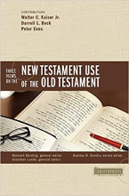
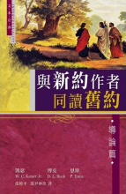
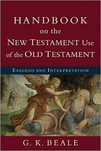
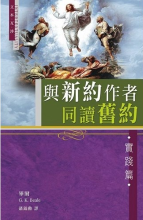
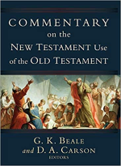
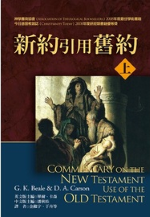

# 新約使用舊約

## 書籍

書摘|封面|書名
---|---|---
[[Berding - 2008 - Three Views on the New Testament Use of the Old Testament]]|![[3Views-cover.png]]|Berding, Kenneth, and Jonathan Lunde, eds. *Three Views on the New Testament Use of the Old Testament*. Counterpoints. Grand Rapids: Zondervan, 2008.

Jared M. Compton, “Shared Intentions?  Reflections on Inspiration and Interpretation  in Light of Scripture’s Dual Authorship,” Themelios 33.3 (2008): 23–33.

---

書摘|封面|書名
---|---|---
[3Views](Berding%20-%202008%20-%20Three%20Views%20on%20the%20New%20Testament%20Use%20of%20the%20Old%20Testament)||Berding, Kenneth, and Jonathan Lunde, eds. *Three Views on the New Testament Use of the Old Testament*. Counterpoints. Grand Rapids: Zondervan, 2008.
[3Views](Berding%20-%202008%20-%20Three%20Views%20on%20the%20New%20Testament%20Use%20of%20the%20Old%20Testament)||凱瑟 (W. C. Kaiser Jr.)、博克 (D. L. Bock)、恩斯 (P. Enns)。《與新約作者同讀舊約：導論篇》。邵尹妙珍譯、邵樟平譯。香港：天道書樓，2014。
[Handbook](Handbook/README.md)||Beale, G. K. *Handbook on the New Testament Use of the Old Testament: Exegesis and Interpretation*. Grand Rapids: Baker Academic, 2012.
[Handbook](Handbook/README.md)||畢爾 (G. K. Beale)。《與新約作者同讀舊約：實踐篇》。聶錦勳譯。香港：天道書樓，2016。
[CNTUOT](CNTUOT/README.md)||Beale, G. K., and D. A. Carson, eds. *Commentary on the New Testament Use of the Old Testament*. Grand Rapids; Nottingham: Baker Academic; Apollos, 2007.
[CNTUOT](CNTUOT/README.md)||畢爾(G. K. Beale)編、卡森(D. A. Carson)編。《新約引用舊約》。潘秋松譯。上、下冊。美國：美國麥種傳道會，2012。

## 期刊

- [Moo, Douglas J., and Andrew David Naselli. “The Problem of the New Testament’s Use of the Old Testament.” Pages 702–46 in *The Enduring Authority of the Christian Scriptures.* Edited by D. A. Carson. Grand Rapids, Michigan: William B. Eerdmans Publishing Company, 2016.](articles/Moo-2016.md)
- [Beale, Greg. “The Right Doctrine, Wrong Texts: Can We Follow the Apostles’ Doctrine but Not Their Hermeneutics?” *Foundations* 60 (2011): 39–46.](articles/Beale-2011.md)
- [Sequeira, Aubrey, and Samuel C Emadi. “Biblical-Theological Exegesis and the Nature of Typology.” SBTJ 21.1 (2017): 11–34.](articles/)
- 

